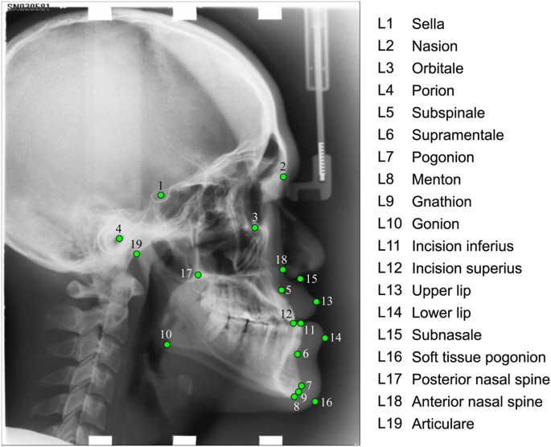

# Chepalometric Landmarks Detection

Detection of chepalometric landmarks with Deep learning models.
Dataset:
- 400 X-ray images each image contains 19 landmarks.
- Excel sheets containg X and Y positions for each landmark in each image.

 
